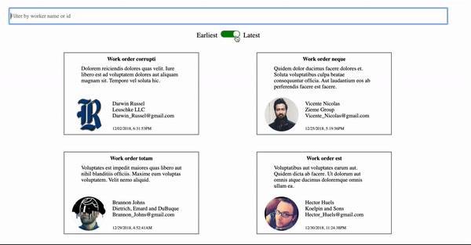

# Frontend Assessment

## Demo



## About 

This project was done accordingly for Hatchway's Frontend Assessment. The project utilizes React as the frontend framework and SASS as the CSS preprocessor.  Express is used as the application framework and Node as the backend server-side scriptor.

## Setup
```
  npm install
  npm run dev
  npm run start
```

## Listen
```
  localhost:3000
```
## On Load

The project will call on Hatchway's work orders api and fetch the work orders once the client requests for the data.  Once the work orders are retrieved, unique worker id's are stored and requested.  Once worker information is retrieved, work orders will be iterated through and include worker information that matches the id.  This will prevent it from making duplicate requests for efficiency.

## Filter Bar

The Filter Bar allows for dynamic changes to the list when entering the letters of a worker's name.

## Switch

The Switch feature allows for the list to be sorted by earliest or latest deadling, with earliest being the default.
